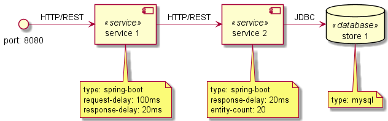

microzoo
========


microzoo is an experimental kit for exploring and testing microservice technologies and architectures with focus on
simplicity and ease-of-use. microzoo may well serve as a tool

- to test and evaluate microservice technologies such as different frameworks and stacks
- to create a test setup for evaluation of microservice hosting environments
- for teaching and learning

microzoo consists of a library of

- a standard microservice implemented with different languages and frameworks (currently spring boot)
- persistence components (currently MySql, Postgres and MariaDB)
- microservice infrastructure components (not yet included)

All components can be configured to allow the modelling of real-world scenarios to a certain degree.

> As microzoo is work-in-progress, some features may not completely work as expected.
> All parts of the system may change over time and we are constantly adding new features. Please check back frequently. 

Available components:
- **Service implementations:** Spring Boot
- **Databases:** MySql, PostgreSql, MariaDB
- **Execution environments**: docker-compose

Installation
------------

### Prerequisites
- Linux environment (Windows: WSL2)
- Installed git
- installed docker and docker-compose
- installed node/npm
- PlantUML Editor/Viewer (optional)

````
    git clone https://github.com/iteratec/microzoo.git
    cd processor && npm install
````

How to use
----------

microzoo stacks are normally specified as [PlantUml component diagrams](https://plantuml.com/en/component-diagram):



PlantUml uses a textual representation and can generate a UML visualization from it:

````
@startuml

database "store 1" <<database>>
note bottom of "store 1" {
    type: mysql
}

component "service 1" <<service>>
note bottom of "service 1" {
    type: spring-boot
    request-delay: 100ms
    response-delay: 20ms
}

component "service 2" <<service>>
note bottom of "service 2" {
    type: spring-boot
    response-delay: 20ms
    entity-count: 20
}

interface "port: 8080"

[service 1] -> [service 2]: HTTP/REST

[service 2] -> [store 1]: JDBC

[port: 8080] -> [service 1]: HTTP/REST

@enduml
````

microzoo supports a subset of the features of PlantUml to describe its microservice stacks and generates
a setup for container execution/orchestration platforms (currently docker) which can be directly executed. 

The running system can be tested using [K6](https://k6.io/), observed with [portainer](https://www.portainer.io/)
or monitored with [Prometheus](https://prometheus.io/) and [Grafana](https://grafana.com/). Integrated support for
these and other tools will be added to microzoo soon.

Getting started
---------------

0. Install microzoo as described in section *Installation*
1. In the folder *scenarios* add a puml-file *my-architecture.puml* with your stack.
   See the [supported PlantUml syntax](doc/supported_plantuml.md).
2. Run `bin/microzoo deploy my-architecture`
3. Copy *stacks/basic/tester* to *stacks/my-architecture/tester* and run `bin/microzoo test my-architecture` (Integrated support for tests will be added)

For details see [microzoo CLI](doc/microzoo_cli.md)

How to extend
-------------

microzoo is extensible in various ways:

- add services implemented in a certain language/framework
- add persistence and other components
- add deployment support for other orchestration platforms

All components are added in the folder structure under 'components' and need a manifest named mcirozoo.yml
as minimal requirement.

See the [microzoo extension guide](doc/extension_guide.md) for details.

License
-------

Copyright 2021 Peter Kullmann, [iteratec GmbH](https://www.iteratec.com)

Licensed under the Apache License, Version 2.0 (the "License");
you may not use this work except in compliance with the License.
You may obtain a copy of the License at

> [http://www.apache.org/licenses/LICENSE-2.0](http://www.apache.org/licenses/LICENSE-2.0)

Unless required by applicable law or agreed to in writing, software
distributed under the License is distributed on an "AS IS" BASIS,
WITHOUT WARRANTIES OR CONDITIONS OF ANY KIND, either express or implied.
See the License for the specific language governing permissions and
limitations under the License.
