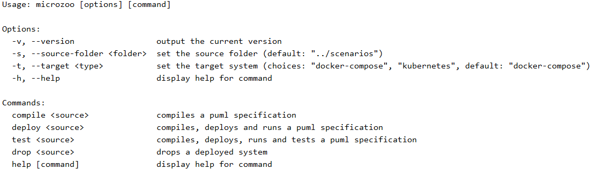

#The microzoo CLI

### `bin/microzoo compile <source>`

*`<source>`* refers to a puml file stored in the folder *scenarios*. The deployment script (e.g. docker-compose.yml)
is written to folder within *stacks*. 

### `bin/microzoo deploy <source>`

Compiles and deploys the stack. 

### `bin/microzoo drop <source>`

Undeploys a running system. 

### `bin/microzoo test <source>`

Runs a dspecified test. Currently this executes a K6 script located in the folder *tester/k6* within the stack folder.
(Note: Currently the test script needs to be copied manually to this folder) 
